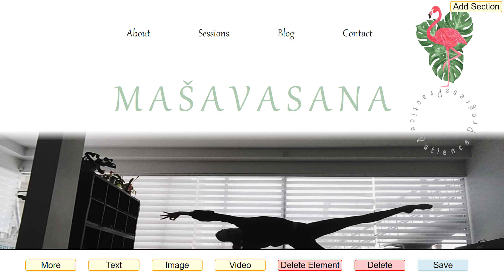

# masavasana

Basic CMS website editor for creating a one page scrolling website.

Written in PHP, JavaScript, HTML5 and CSS 3. Using Quill JS for text editing.  
The CMS collates the changes into a static HTML file.

## Screenshots

### Main editor

### Text editor using Quill JS

